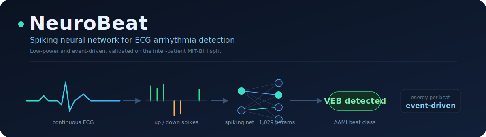
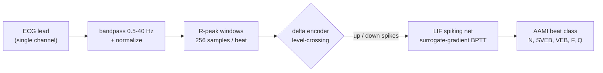
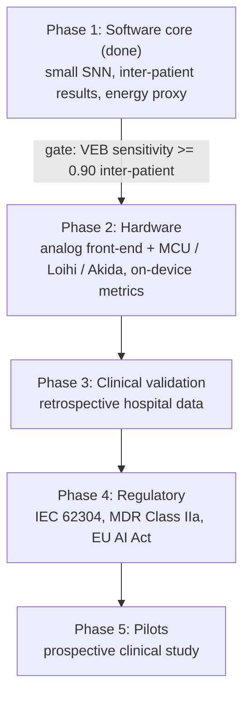

<p align="center">
  
</p>

<p align="center">
  
  
  
  
  
</p>

NeuroBeat is a spiking neural network (SNN) that classifies single-lead ECG heartbeats
into the five AAMI arrhythmia classes (N, SVEB, VEB, F, Q). The goal is a model small and
low-power enough to eventually run on a wearable patch. It is validated on an
inter-patient split, so the reported numbers reflect performance on patients the model
was not trained on.

## Overview

Arrhythmias are heart-rhythm problems that often come and go, so detecting them usually
means monitoring over days or weeks. Small wearable monitors make that easier, but they
have a limited power budget, which limits how much computation they can do.

A spiking neural network only does work when its input changes, instead of at every time
step. This event-driven behavior maps well to low-power hardware. NeuroBeat uses that
property: it encodes the ECG as sparse spike events and runs a small SNN on them, so the
same design could later run on a low-power chip.

The classifier in this project has 1,029 parameters. On patients it was not trained on,
it detects about 81% of ventricular ectopic beats (VEB), which is close to a conventional
CNN roughly three times its size. This is a software proof of concept, meant to test
whether the approach works before spending on hardware.

## How it works



A single-lead ECG is bandpass filtered and normalized, split into fixed windows around
each R-peak, encoded into spikes, and classified by the SNN into one of the five AAMI
classes.

### Spike encoding

The delta encoder (also called level-crossing encoding) converts the continuous ECG into
spike events. It keeps a running reference value and emits a spike only when the signal
moves up or down by a fixed threshold. A flat signal produces no spikes; a sharp QRS
complex produces several. The output has two channels, one for upward crossings and one
for downward crossings.

```
 raw ECG   ─╮        ╭────╮              keep a moving reference and emit a spike
            ╰─╮   ╭──╯    ╰──╮           only when the signal crosses by +/- threshold
              ╰───╯          ╰────
                                         up:    . .   | | |   . .   | |
 spikes  ──►                             down:  . . . . .   | . . | .
                                         time ->
```

This encoding is sparse, so most of the time there is little to process, which is where
the low power comes from. It also matches what an analog comparator front-end would
produce in hardware, so the network trains on the same kind of input a real device would
generate.

### The network

The model is a two-layer network of leaky integrate-and-fire (LIF) neurons, trained with
surrogate-gradient backpropagation through time using snnTorch. One detail from
development: reading the output as spike counts caused the network to stop firing and get
stuck (a dead-neuron problem). Reading the output neurons' membrane potential instead
keeps the gradient usable, so the model trains. The hidden layer still produces spikes,
which is what gives the sparse-compute benefit.

## Methodology

Two choices keep the results comparable to clinical standards and prevent inflated
numbers.

| Choice | What it means | Why it matters |
|---|---|---|
| Inter-patient split | Train on DS1 patients, test on DS2 patients (de Chazal split). Paced records excluded per AAMI EC57. | Random splits can put beats from the same patient in both train and test, which inflates accuracy. Inter-patient numbers are lower but reflect performance on new patients. |
| Per-class metrics | Report sensitivity and positive predictivity (PPV) for VEB and SVEB, not only accuracy. | About 89% of beats are normal, so always predicting "normal" already gives about 89% accuracy. Per-class metrics show what the model actually detects. |

## Results (MIT-BIH, inter-patient DS1 to DS2)

DS1 train = 51,000 beats. DS2 test = 49,693 beats. 20 epochs, seed 1337, inverse-frequency
class weighting for all models. Metrics per AAMI EC57.

| Model | Params | VEB Sens | VEB PPV | SVEB Sens | SVEB PPV | Overall Acc | SynOps/beat |
|:--|--:|:--:|:--:|:--:|:--:|:--:|--:|
| SNN (delta) | 1,029 | 0.808 | 0.320 | 0.407 | 0.064 | 0.629 | 33,277 |
| CNN1D | 2,885 | 0.835 | 0.770 | 0.569 | 0.093 | 0.684 | n/a |
| LSTM | 17,477 | 0.626 | 0.160 | 0.020 | 0.015 | 0.567 | n/a |

Notes on the results:

- The SNN has the fewest parameters (1,029) and reaches 0.808 VEB sensitivity on unseen
  patients, close to the CNN (0.835) and higher than the LSTM (0.626).
- Class weighting raises minority-class sensitivity but lowers precision, so the SNN has
  more false positives on VEB (PPV 0.320). SVEB is hard for all three models because
  supraventricular beats are subtle on a single lead.
- Overall accuracy is low on purpose. The models are not optimized for it, since per-class
  sensitivity is the more useful metric here.

A hyperparameter sweep (delta threshold and class-weight scheme, see
[`experiments/sweep_snn.py`](experiments/sweep_snn.py)) is testing whether a configuration
can reach the Phase 2 target of VEB sensitivity >= 0.90. Results are written to
`runs/sweep_results.json`.

## Roadmap



Phase 1 (this repository) is the software core. Later phases add hardware, clinical
validation, regulatory work, and pilots, and each phase starts only after the previous
gate is met. The SynOps (synaptic operations) column in the results table is a proxy for
energy use: it counts sparse events per beat and can be converted into a power estimate
for neuromorphic hardware.

## Repository structure

```
src/neurocardio/
  data/       load ECG, bandpass/normalize, R-peak beat windows, AAMI labels, DS1/DS2 split
  encoding/   delta.py  (level-crossing spike encoder), rate.py (rate-coding baseline)
  models/     snn.py    (LIF spiking classifier), baselines.py (CNN1D, LSTM)
  train/      training loop, seeding, class weighting, device resolution
  eval/       confusion matrix, AAMI sensitivity/PPV, evaluate over a DataLoader
  deploy/     energy.py (SynOps + spike-count energy proxy)
  stream/     online R-peak detector and StreamDetector (timestamped anomaly logging)
  cli.py      download, train, evaluate
experiments/  sweep_snn.py (GPU hyperparameter sweep)
tests/        44 tests, one per module, hermetic (no network, small wfdb fixtures)
```

## Setup

```bash
uv venv --python 3.11
uv pip install -e ".[dev]"
uv run pytest -q
```

## Reproduce the results

```bash
uv run neurocardio download --dest data/mitdb
uv run neurocardio train --config configs/snn.yaml  --out runs/snn.pt
uv run neurocardio train --config configs/cnn.yaml  --out runs/cnn.pt
uv run neurocardio train --config configs/lstm.yaml --out runs/lstm.pt
```

`configs/{snn,cnn,lstm}.yaml` set `seed: 1337` and `device: auto` (GPU if available,
otherwise CPU). The SNN uses delta-encoded spikes; the CNN and LSTM use raw beats.

Note on compute: the SNN forward pass is a 256-step loop, so it is limited by per-step
latency rather than throughput. A GPU improves throughput but not the number of gradient
updates per second, so training takes a similar amount of time on CPU or GPU. Vectorizing
the time loop would help more than changing hardware.

## Known risks

- Inter-patient generalization is the main risk. Do not report intra-patient numbers as
  headline results.
- Class imbalance: keep class weighting or a similar method, and always report per-class
  metrics.
- Noise: real ambulatory ECG is noisier than MIT-BIH, so a noise-robustness study is
  needed before any pilot.
- Regulation: EU AI Act and MDR requirements change over time, so the technical
  documentation should be kept current.

Phase 1 proof of concept. Built on public PhysioNet data. Metrics per AAMI EC57.
