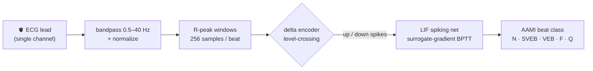
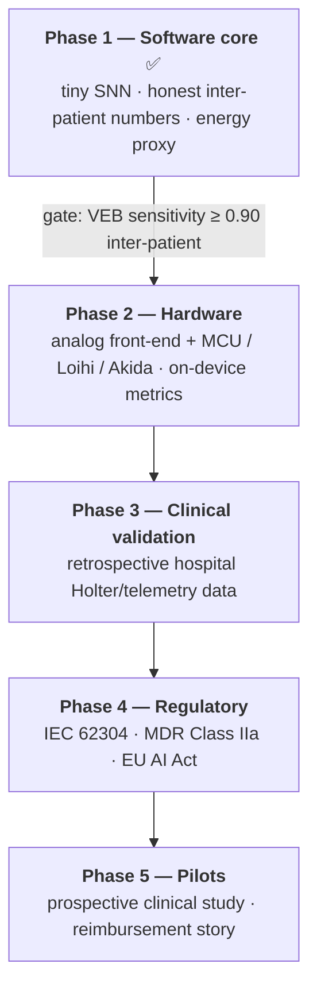

<p align="center">
  
</p>

<p align="center">
  
  
  
  
  
  
</p>

> **NeuroBeat** teaches a *brain-inspired* chip to watch a heartbeat. Instead of a
> power-hungry neural network that wakes up and crunches every millisecond, it uses a
> **spiking** network — one that only does work when the signal actually *changes*,
> the way real neurons do — so it could one day run for years on a coin-cell inside an
> adhesive patch and flag dangerous heartbeats in real time.

---

## The 30-second version

**The problem.** Millions of people have heart-rhythm problems (arrhythmias) that come
and go. Catching them means monitoring for days or weeks — but today's wearables are a
compromise: the accurate ones are bulky and their batteries die fast, and the tiny ones
miss the subtle, rare beats that matter most.

**The idea.** The brain runs on ~20 watts and processes signals with *spikes* — brief
electrical events — doing nothing in between. A **spiking neural network (SNN)** copies
that trick in silicon. If we feed it the heartbeat as a stream of spikes and keep the
network small enough, it can live on a **sub-milliwatt** chip: think a band-aid that
monitors your heart for *weeks* and only ever "thinks" when something changes.

**Why it's cool.** NeuroBeat's classifier has just **1,029 parameters** — thousands of
times smaller than a typical deep network — yet on patients it has *never seen* it
already catches **~81% of dangerous ventricular beats**, matching a conventional CNN
three times its size. That's the whole bet of neuromorphic medicine, shown to work in
software before a single chip is bought.

---

## How it works

A single-lead ECG becomes a beat, the beat becomes spikes, and a spiking network reads
the spikes to name the beat — the same representation a hardware chip would produce.



### The heart of it: turning a wave into spikes

Real analog sensors don't emit neat numbers — they emit *events*. NeuroBeat's **delta
(level-crossing) encoder** mirrors that exactly: it tracks the ECG against a moving
reference and fires a spike **only** when the voltage climbs or drops by a fixed step
`Δ`. Flat signal → silence. Sharp QRS spike → a burst of events.

```
 raw ECG  ─╮        ╭────╮                 compare to a moving reference;
           ╰─╮   ╭──╯    ╰──╮              emit a spike ONLY on a ±Δ crossing
             ╰───╯          ╰────
                                           ↑ ↑ ↑        ↓ ↓            (up channel)
 spikes ──►      · ·   ▏ ▏ ▏   · ·   ▏ ▏   · ·          (2 sparse channels)
                                           time →
```

This is why the whole thing can be low-power: **the encoder is silent most of the
time**, the hidden layer only spikes when there's something to say, and "compute" is
just those sparse events. It's also *hardware-faithful* — the same up/down comparator
you'd build in an analog front-end — so the network trains on the representation the
eventual chip will actually deliver.

### The network

A small two-layer network of **leaky integrate-and-fire (LIF)** neurons, trained with
surrogate-gradient backpropagation-through-time (snnTorch). One subtlety we learned the
hard way: reading out *spike counts* makes the network collapse into silence (a dead-
neuron trap); reading the output neurons' **membrane potential** instead keeps a healthy
gradient, so it actually learns. The hidden layer still spikes — that's where the
sparse-compute energy win lives.

---

## Why the numbers are honest (and most published ones aren't)

Two guardrails are baked in and non-negotiable — they're the difference between a demo
and evidence a cardiologist or regulator would trust.

| Guardrail | What it means | Why it matters |
|---|---|---|
| **Inter-patient split** | Train on one set of patients (de Chazal **DS1**), test on a *completely different* set (**DS2**). Paced records excluded per AAMI EC57. | Random splits leak beats from the same patient into train **and** test, inflating accuracy to ~99% that collapses on new patients. We report the hard number from day one. |
| **Per-class AAMI metrics** | Report **sensitivity** and **positive predictivity (PPV)** for VEB and SVEB, not overall accuracy. | ~89% of beats are normal, so "predict normal" already scores ~0.89. Accuracy hides everything clinical; per-class recall is what a cardiologist reads. |

---

## Phase-1 results (MIT-BIH, inter-patient DS1 → DS2)

DS1 train = 51,000 beats · DS2 test = 49,693 beats · 20 epochs · seed 1337 · all models
trained with inverse-frequency class weighting. Metrics per AAMI EC57.

| Model | Params | VEB Sens | VEB PPV | SVEB Sens | SVEB PPV | Overall Acc | SynOps/beat |
|:--|--:|:--:|:--:|:--:|:--:|:--:|--:|
| 🧠 **SNN (delta)** | **1,029** | **0.808** | 0.320 | 0.407 | 0.064 | 0.629 | 33,277 |
| CNN1D | 2,885 | 0.835 | 0.770 | 0.569 | 0.093 | 0.684 | — |
| LSTM | 17,477 | 0.626 | 0.160 | 0.020 | 0.015 | 0.567 | — |

**What this says.** The **1,029-parameter SNN — the smallest model by far — reaches
0.808 VEB sensitivity on unseen patients**, essentially matching the CNN (0.835) and far
ahead of the LSTM (0.626). Detecting ventricular ectopic beats is the clinically load-
bearing case, and a network this tiny doing it inter-patient is the core evidence that a
sub-milliwatt spiking chip is a credible target.

**The honest weak spots.** Class weighting buys minority *sensitivity* at the cost of
*precision*, so the SNN over-calls VEB (PPV 0.32) and everyone struggles with SVEB
(supraventricular beats are subtle on a single lead). Overall accuracy is *deliberately*
unimpressive — that's the point of not optimizing for it.

> 🔬 **In progress:** a GPU hyperparameter sweep (delta-threshold × class-weight scheme,
> see [`experiments/sweep_snn.py`](experiments/sweep_snn.py)) is pushing to clear the
> **Phase-2 gate of VEB sensitivity ≥ 0.90**. Results land in `runs/sweep_results.json`.

---

## The evolution — from proof-of-concept to patch

Software first, so every expensive step downstream is bought only after the previous
gate is cleared.



The **SynOps** (synaptic-operations) column above is what makes "low-power" a *number*,
not an adjective: it counts the sparse events per beat and ports directly to a
Loihi/Akida power estimate in Phase 2.

---

## What's in the box

```
src/neurocardio/
  data/       load ECG · bandpass/normalize · R-peak beat windows · AAMI labels · DS1/DS2 split
  encoding/   delta.py  ← the level-crossing spike encoder (the neuromorphic core) · rate.py
  models/     snn.py    ← LIF spiking classifier · baselines.py (CNN1D, LSTM)
  train/      training loop · seeding · class weighting · device resolution
  eval/       confusion matrix · AAMI sensitivity/PPV · evaluate-over-loader
  deploy/     energy.py ← SynOps + spike-count energy proxy
  stream/     online R-peak detector + StreamDetector (timestamped anomaly logging)
  cli.py      download · train · evaluate
experiments/  sweep_snn.py ← GPU hyperparameter sweep
tests/        44 tests, one per module — hermetic, no network, tiny wfdb fixtures
```

---

## Quickstart

```bash
uv venv --python 3.11
uv pip install -e ".[dev]"
uv run pytest -q                       # 44 tests, ~2 min on CPU
```

### Reproduce the results

```bash
uv run neurocardio download --dest data/mitdb          # ~100 MB from PhysioNet
uv run neurocardio train --config configs/snn.yaml  --out runs/snn.pt
uv run neurocardio train --config configs/cnn.yaml  --out runs/cnn.pt
uv run neurocardio train --config configs/lstm.yaml --out runs/lstm.pt
```

`configs/{snn,cnn,lstm}.yaml` fix `seed: 1337` and `device: auto` (uses the GPU if one is
present, else CPU). The SNN consumes delta-encoded spikes; the CNN/LSTM baselines read
raw beats.

> ⚙️ **Compute note.** The SNN's forward pass is a 256-step sequential loop over tiny
> matmuls, so it's *latency-bound*: a GPU helps throughput but not gradient-updates-per-
> second, and each training run is minutes-to-hours regardless of hardware. The real
> speed-up lever is vectorizing the timestep loop — a worthwhile follow-up before large
> sweeps.

---

## Roadmap risks we're watching

- **Inter-patient generalization** is make-or-break — never report intra-patient numbers as headline.
- **Class imbalance** (rare arrhythmias) — carry class weighting / focal loss / resampling forward; always report per-class.
- **Motion & noise** — real ambulatory ECG is far noisier than MIT-BIH; a dedicated robustness study precedes any pilot.
- **Regulatory drift** — the EU AI Act and MDR timelines move; keep the technical file living, not a one-time deliverable.

---

<p align="center"><sub>Phase-1 proof-of-concept · built on free public PhysioNet data · methodology per AAMI EC57</sub></p>
