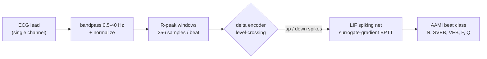
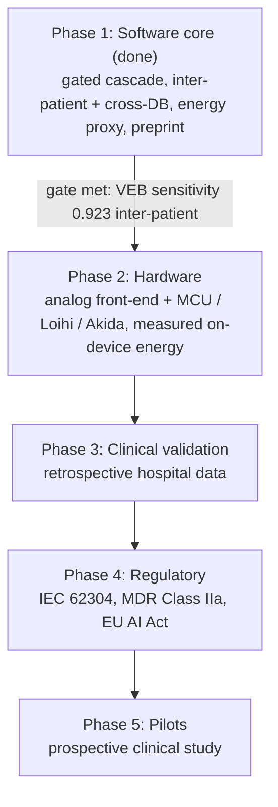

<p align="center">
  
</p>

<p align="center">
  
  
  
  
  
  
</p>

<p align="center">
  <b><a href="https://talch87.github.io/neuro-beat/">Live results dashboard</a></b> &middot;
  current experiments and honest inter-patient numbers, updated as runs complete.
</p>

NeuroBeat is a spiking neural network (SNN) that classifies single-lead ECG heartbeats
into the five AAMI arrhythmia classes (N, SVEB, VEB, F, Q). The goal is a model small and
low-power enough to eventually run on a wearable patch. It is validated on an
inter-patient split, so the reported numbers reflect performance on patients the model
was not trained on.

## Overview

Arrhythmias are heart-rhythm problems that often come and go, so detecting them usually
means monitoring over days or weeks. Small wearable monitors make that easier, but they
have a limited power budget, which limits how much computation they can do.

A spiking neural network only does work when its input changes, instead of at every time
step. This event-driven behavior maps well to low-power hardware. NeuroBeat uses that
property: it encodes the ECG as sparse spike events and runs a small SNN on them, so the
same design could later run on a low-power chip.

The shipped detector, **NeuroBeat-VEB v1**, is a two-stage gated-ensemble cascade for
ventricular ectopic beat (VEB) detection. On patients it was not trained on (MIT-BIH DS2)
it reaches **VEB sensitivity 0.923 at PPV 0.616 within 23,385 SynOps per beat**, and holds
VEB sensitivity at or above 0.90 across three databases (DS2, SVDB, INCART) under one frozen
operating point. A [validation-locked, energy-accounted preprint](paper/neurobeat.md)
documents the full evaluation.

This is a research proof of concept, not a clinical or cleared device. Its main contribution
is evaluation discipline (an operating point locked on validation and never tuned on the test
set, an explicit per-beat energy budget, frozen cross-database testing), not accuracy
leadership: under the identical protocol, stronger non-spiking baselines (a compact TCN,
a ResNet-lite CNN, gradient-boosted trees) match or beat the cascade on accuracy. The spiking
model's case rests on per-beat operation count and neuromorphic suitability, pending measured
hardware energy. Single-lead supraventricular (SVEB) detection is reported as an honest
negative result.

## How it works



A single-lead ECG is bandpass filtered and normalized, split into fixed windows around
each R-peak, encoded into spikes, and classified by the SNN into one of the five AAMI
classes.

### Spike encoding

The delta encoder (also called level-crossing encoding) converts the continuous ECG into
spike events. It keeps a running reference value and emits a spike only when the signal
moves up or down by a fixed threshold. A flat signal produces no spikes; a sharp QRS
complex produces several. The output has two channels, one for upward crossings and one
for downward crossings.

```
 raw ECG   ─╮        ╭────╮              keep a moving reference and emit a spike
            ╰─╮   ╭──╯    ╰──╮           only when the signal crosses by +/- threshold
              ╰───╯          ╰────
                                         up:    . .   | | |   . .   | |
 spikes  ──►                             down:  . . . . .   | . . | .
                                         time ->
```

This encoding is sparse, so most of the time there is little to process, which is where
the low power comes from. It also matches what an analog comparator front-end would
produce in hardware, so the network trains on the same kind of input a real device would
generate.

### The network

The model is a two-layer network of leaky integrate-and-fire (LIF) neurons, trained with
surrogate-gradient backpropagation through time using snnTorch. One detail from
development: reading the output as spike counts caused the network to stop firing and get
stuck (a dead-neuron problem). Reading the output neurons' membrane potential instead
keeps the gradient usable, so the model trains. The hidden layer still produces spikes,
which is what gives the sparse-compute benefit.

## Methodology

Two choices keep the results comparable to clinical standards and prevent inflated
numbers.

| Choice | What it means | Why it matters |
|---|---|---|
| Inter-patient split | Train on DS1 patients, test on DS2 patients (de Chazal split). Paced records excluded per AAMI EC57. | Random splits can put beats from the same patient in both train and test, which inflates accuracy. Inter-patient numbers are lower but reflect performance on new patients. |
| Per-class metrics | Report sensitivity and positive predictivity (PPV) for VEB and SVEB, not only accuracy. | About 89% of beats are normal, so always predicting "normal" already gives about 89% accuracy. Per-class metrics show what the model actually detects. |

## Results (MIT-BIH, inter-patient DS1 to DS2)

**NeuroBeat-VEB v1 (gated-ensemble cascade).** A sparse high-recall screener runs on every
beat and gates a three-seed ensemble confirmer that runs only on the ~27% of beats it flags.
Both operating points are fit only on a DS1 validation holdout and frozen for all test data.

| Database | Beats | VEB Sens | VEB PPV | Flag rate |
|:--|--:|:--:|:--:|:--:|
| MIT-BIH DS2 (held-out) | 49,693 | 0.923 | 0.616 | 0.271 |
| SVDB (supraventricular-rich, 128 Hz) | 184,520 | 0.904 | 0.377 | 0.345 |
| INCART (12-lead, 257 Hz) | 175,811 | 0.901 | 0.835 | 0.241 |

VEB sensitivity holds at or above 0.90 across all three databases under one frozen operating
point; PPV varies with each database's class mix. The cascade meets all three targets on DS2
at once: sensitivity >= 0.90, PPV >= 0.60, and <= 25,000 SynOps/beat.

**Honest context.** The spiking cascade is not the most accurate DS2 VEB detector. Under the
identical protocol, a compact TCN (0.939 / 0.729), a ResNet-lite CNN (0.910 / 0.761), and
gradient-boosted trees (0.974 / 0.678) all reach higher VEB F1; the cascade beats the
higher-sensitivity, lower-precision CNN and linear SVM. What separates it is operation count
(~23k SynOps vs 0.5-1M MACs) and mapping onto neuromorphic hardware, an operation-count
advantage under a proxy pending measured energy. A patient-level bootstrap over the 22 DS2
records gives wide intervals (sensitivity 0.85-0.98, PPV 0.36-0.81), the honest uncertainty
for 22 patients. Replacing annotated R-peaks with a standard detector (XQRS) at inference
lowers end-to-end VEB to 0.884 / 0.593 (below the 0.90 target, but a modest drop). Full
analysis, tables, and figures are in the [preprint](paper/neurobeat.md).

**Phase 1 baseline (single-model, for reference).** DS1 train = 44,573 beats, DS2 test =
49,693 beats. Inverse-frequency class weighting. Metrics per AAMI EC57.

| Model | Params | VEB Sens | VEB PPV | SVEB Sens | SVEB PPV | SynOps/beat |
|:--|--:|:--:|:--:|:--:|:--:|--:|
| SNN (delta) | 1,029 | 0.808 | 0.320 | 0.407 | 0.064 | 33,277 |
| CNN1D | 2,885 | 0.835 | 0.770 | 0.569 | 0.093 | n/a |
| LSTM | 17,477 | 0.626 | 0.160 | 0.020 | 0.015 | n/a |

The gated cascade above supersedes this single-model baseline; the row is kept to show the
starting point. Live status is on the [results dashboard](https://talch87.github.io/neuro-beat/).

## Roadmap



Phase 1 (this repository) is the software core. Later phases add hardware, clinical
validation, regulatory work, and pilots, and each phase starts only after the previous
gate is met. The SynOps (synaptic operations) column in the results table is a proxy for
energy use: it counts sparse events per beat and can be converted into a power estimate
for neuromorphic hardware.

## Repository structure

```
src/neurocardio/
  data/       load ECG, bandpass/normalize, R-peak beat windows, AAMI labels, DS1/DS2 split,
              RR-interval timing features, external-database loading (resample to 360 Hz)
  encoding/   delta.py (level-crossing spike encoder), beat.py (low-timestep count-pooled
              encoder with derivative channels), rate.py (rate-coding baseline)
  models/     snn.py (LIF spiking classifier, optional RR input path), baselines.py (CNN1D, LSTM)
  train/      training loop, seeding, class weighting, device resolution
  eval/       confusion matrix, AAMI sensitivity/PPV, evaluate over a DataLoader
  deploy/     energy.py (SynOps + spike-count energy proxy)
  stream/     online R-peak detector and StreamDetector (timestamped anomaly logging)
  cli.py      download (mitdb/svdb/incartdb), train, evaluate, crossdb (external-DB test)
experiments/  freeze_veb_v1.py (single-stage), gated_ensemble_veb.py (cascade),
              baselines_veb.py / baselines_extra.py (CNN/LSTM/TCN/ResNet-lite/GBT/SVM),
              quantized_cnn.py (int8), error_analysis.py, stats_ci.py, end2end_rpeak.py,
              learning_curve.py, lock_snn_rr.py (val-locked evaluation, no test-set tuning)
models/       neurobeat-veb-v1/ (frozen weights, operating points, model card)
paper/        neurobeat.md (preprint) + neurobeat.tex / .html, figures/
docs/         index.html (results dashboard, served via GitHub Pages)
tests/        60 tests, one per module, hermetic (no network, small wfdb fixtures)
```

## Setup

```bash
uv venv --python 3.11
uv pip install -e ".[dev]"
uv run pytest -q
```

## Reproduce the results

```bash
uv run neurocardio download --dest data/mitdb
uv run neurocardio train --config configs/snn.yaml  --out runs/snn.pt
uv run neurocardio train --config configs/cnn.yaml  --out runs/cnn.pt
uv run neurocardio train --config configs/lstm.yaml --out runs/lstm.pt
```

`configs/{snn,cnn,lstm}.yaml` set `seed: 1337` and `device: auto` (GPU if available,
otherwise CPU). The SNN uses delta-encoded spikes; the CNN and LSTM use raw beats.

To reproduce the shipped **NeuroBeat-VEB v1** cascade and its analyses (all operating
points fit only on the DS1 holdout and frozen for the test databases):

```bash
python experiments/freeze_veb_v1.py       # single-stage, val-locked
python experiments/gated_ensemble_veb.py  # gated-ensemble cascade (the v1 artifact)
python experiments/baselines_extra.py     # TCN/ResNet-lite/GBT/SVM + paired bootstrap
python experiments/end2end_rpeak.py       # detected-R-peak end-to-end ablation
```

### External validation (cross-database)

Training on MIT-BIH and testing on a different database is a stricter generalization test
than DS1 to DS2 alone. The `crossdb` command downloads and resamples other PhysioNet
databases to 360 Hz and runs the same beat/AAMI pipeline:

```bash
uv run neurocardio download --db svdb        # MIT-BIH Supraventricular (128 Hz, SVEB-rich)
uv run neurocardio download --db incartdb    # St. Petersburg INCART (257 Hz, VEB-rich)
uv run neurocardio crossdb --config configs/snn.yaml --weights runs/snn.pt --data-dir data/svdb
```

Report each database separately; do not merge external numbers into the MIT-BIH DS2 figure.
Lead ordering differs across databases, so set `--lead` deliberately (for example lead II is
index 1 on INCART, index 0 on MIT-BIH).

Note on compute: the SNN forward pass is a 256-step loop, so it is limited by per-step
latency rather than throughput. A GPU improves throughput but not the number of gradient
updates per second, so training takes a similar amount of time on CPU or GPU. Vectorizing
the time loop would help more than changing hardware.

## Known risks

- Inter-patient generalization is the main risk. Do not report intra-patient numbers as
  headline results.
- Class imbalance: keep class weighting or a similar method, and always report per-class
  metrics.
- Noise: real ambulatory ECG is noisier than MIT-BIH, so a noise-robustness study is
  needed before any pilot.
- Regulation: EU AI Act and MDR requirements change over time, so the technical
  documentation should be kept current.

## License

NeuroBeat is available under AGPL-3.0 for open research and reproducible use.
Commercial licensing is available for organizations that want to integrate, modify,
or deploy NeuroBeat without AGPL obligations.

NeuroBeat is dual-licensed: **AGPL-3.0** for open-source use (see [`LICENSE`](LICENSE)), or a
**commercial license** for proprietary/closed-source use. See [`LICENSING.md`](LICENSING.md) for
details and how to obtain a commercial license. Copyright (C) 2026 Talch87.

Phase 1 proof of concept. Built on public PhysioNet data. Metrics per AAMI EC57.
