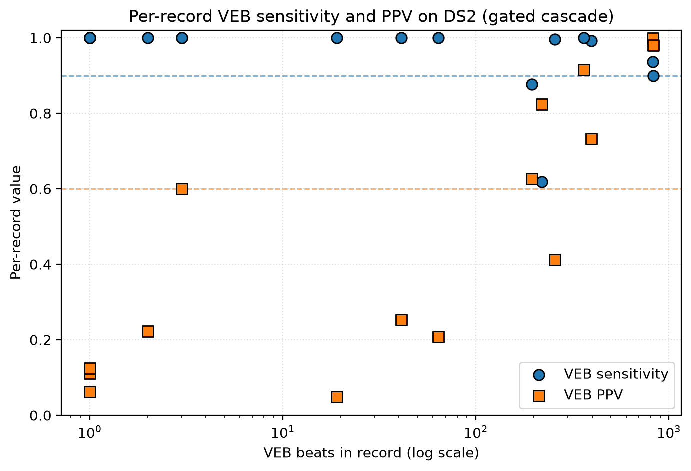

| Independent researcher
| Contact: valerio@covenance.ai
| Code, weights, and live dashboard: github.com/Talch87/neuro-beat and talch87.github.io/neuro-beat

## Abstract

**Problem.** Spiking neural networks (SNNs) are attractive for always-on cardiac
monitoring because event-driven computation maps onto low-power neuromorphic
hardware. Yet much of the SNN-ECG literature reports accuracy under protocols that
inflate it (intra-patient splits, test-set-selected thresholds) and rarely reports the
per-inference compute that motivates the approach.

**Approach.** We present NeuroBeat, a deliberately simple leaky-integrate-and-fire
network for ventricular ectopic beat (VEB) detection, evaluated under a conservative
protocol: a patient-disjoint inter-patient split (MIT-BIH DS1 to DS2), an operating
point fit only on a DS1 validation holdout and then frozen for all test data, an
explicit per-beat synaptic-operation (SynOps) budget, and frozen cross-database
testing on two external databases.

**Result.** No single operating point reaches both high sensitivity and high precision
(VEB sensitivity 0.894 at PPV 0.490, or 0.857 at 0.679), consistent with calibration
variance under a small holdout. A gated-ensemble cascade, in which a sparse
high-recall screener gates a three-seed confirmer on the roughly 27% of beats it
flags, reaches VEB sensitivity 0.923 at PPV 0.616 on DS2 within 23,385 SynOps/beat and
holds sensitivity at or above 0.90 across DS2, SVDB, and INCART under one frozen
operating point. A patient-level bootstrap gives wide intervals (sensitivity 0.850 to
0.976, PPV 0.355 to 0.814), the honest uncertainty for 22 test patients; with a
standard R-peak detector instead of annotations, end-to-end detection falls modestly
to 0.884 / 0.593.

**Limitations.** SynOps is a compute proxy, not measured energy, and stronger
non-spiking baselines match or beat the cascade on accuracy, so the spiking model's
case rests on per-beat operation count rather than accuracy. Single-lead
supraventricular (SVEB) detection is an unresolved negative result. The contribution
is a validation-locked, energy-accounted evaluation pattern and a cascade that
improves the sensitivity/PPV/energy tradeoff, positioning the method as a candidate
low-power VEB screening component, not a diagnostic system.

## 1. Introduction

Long-term ambulatory ECG is increasingly recorded by wearable and patch devices
that must operate for days on a small battery. Ventricular ectopic beats are
clinically meaningful: their frequency and patterning (for example couplets and
non-sustained ventricular runs) are used in risk stratification, and reliable beat
labelling underpins Holter reporting. A detector intended for continuous,
on-device operation therefore has two coupled requirements: it must be sensitive,
because missed ventricular beats are the costly error, and it must be inexpensive
per beat, because energy determines battery life and thermal envelope.

Spiking networks are a candidate for this regime. They compute with sparse binary
events, and on neuromorphic substrates the dominant cost is the number of synaptic
operations actually triggered by spikes rather than a fixed clocked cost per
layer. This has motivated a body of SNN-ECG work. Our reading of that literature,
consistent with a recent systematic review [Silva2025], is that two recurring
issues limit how far its accuracy numbers can be trusted for deployment.

First, evaluation is frequently optimistic. Under an intra-patient split, beats
from the same patient appear in both training and test sets, so the model can
exploit patient-specific morphology that a device deployed on a new patient never
observes; reported accuracy then overstates real inter-patient performance.
Separately, selecting the decision threshold (or per-class bias) on the test set
leaks label information that is unavailable at deployment time, again inflating the
headline metric. Neither practice is exotic; both are common enough that
cross-study comparison is unreliable [Silva2025].

Second, energy is usually not accounted for. The stated reason to use an SNN is
efficiency, yet many reports give only accuracy or parameter counts, with no
per-inference operation budget against which efficiency could be judged.

The contribution of this paper is therefore not a novel architecture. The network
is intentionally small and conventional. The contribution is evaluation discipline
and an energy-accounted deployment framing: an operating point that is locked on
validation data and never touched on test data, an explicit SynOps budget applied
to every configuration, frozen cross-database testing, and a gated cascade that
improves the sensitivity/PPV/energy tradeoff within that budget. We also report,
rather than hide, a clear negative result for supraventricular beats on a single
lead.

**Contributions.**

1. **A validation-locked inter-patient protocol.** We adopt the de Chazal DS1/DS2
   patient-disjoint split [deChazal2004], hold out three DS1 records as a
   patient-disjoint validation set, fit the operating point only on that holdout,
   and freeze it for DS2 and all external data. No reported test number
   participates in selecting the operating point on the split it is reported on
   (Section 6).
2. **An explicit per-beat SynOps budget.** We define a per-beat synaptic-operation
   count (Section 5.4), report it for every configuration, and hold each to a fixed
   25,000 SynOps/beat budget.
3. **Frozen cross-database validation.** The single frozen operating point is
   applied unchanged to two databases the model never trained on (SVDB, INCART),
   quantifying transfer under distribution shift.
4. **A gated-ensemble cascade within budget.** A sparse screener on every beat
   gates a small ensemble confirmer on flagged beats, reaching VEB sensitivity
   0.923 at PPV 0.616 within 23,385 SynOps/beat, which no single-stage model in our
   sweep achieves.
5. **A negative result for single-lead SVEB.** Under the same protocol, single-lead
   supraventricular detection does not reach usable precision, and we document why
   and how it fails rather than tuning it to a misleading number.

## 2. Related Work

**(a) ECG arrhythmia classification and inter-patient evaluation.** The ANSI/AAMI
EC57 standard [AAMI-EC57] defines the five heartbeat classes and the
sensitivity/PPV reporting convention used throughout this literature. de Chazal et
al. [deChazal2004] introduced the patient-disjoint DS1/DS2 partition of the 44
non-paced MIT-BIH records (about 50,000 beats per set) that has become the
reference inter-patient benchmark. Many subsequent methods report higher raw
accuracy than we do, but a substantial share do so under intra-patient splits or
with test-set-selected thresholds; the systematic review of Silva et al.
[Silva2025] documents that few studies simultaneously satisfy inter-patient
partitioning, AAMI compliance, and embedded feasibility. We do not claim to beat
the strongest reported numbers on raw accuracy; we claim comparability under a
stricter, leakage-controlled protocol with an energy budget.

**(b) Low-power and embedded ECG inference.** A parallel line of work targets
resource-constrained deployment through quantized and compact convolutional or
temporal-convolutional models, pruning, and microcontroller implementations. These
approaches report MACs, memory footprint, or measured microcontroller energy.
They are the natural non-spiking comparison point for efficiency claims; we include
convolutional, recurrent, temporal-convolutional, residual-CNN, gradient-boosted-tree,
and SVM baselines, plus a weight-only int8 CNN, under the identical protocol
(Section 7.8).

**(c) Spiking and neuromorphic ECG.** SNN-ECG methods report competitive MIT-BIH
accuracy using delta-modulation encoding of the ECG and its derivatives
[SNN-ECG-BSPC2021], spike-driven processors for wearable ECG [Chu2022],
hardware/software co-design [SparrowSNN2024], and axonal-delay models
[AxonalDelays2025]. Our count-pooled delta encoding over signal orders is in this
family. We differ in evaluation rather than in mechanism: we report validation-
locked inter-patient results with an explicit SynOps budget, frozen cross-database
transfer, and a documented single-lead SVEB failure.

**(d) Cascaded and gated inference.** Two-stage screener/confirmer and
energy-gated designs are established elsewhere for trading average compute against
accuracy. We use the pattern narrowly: to make an ensemble-grade confirmer
affordable on average by invoking it only on candidates a cheap screener flags.

**(e) Evaluation hygiene and reproducibility.** Our protocol choices follow the
recommendations surveyed in [Silva2025]. We additionally release code, frozen
weights, per-seed logs, and a public results page so that every reported number is
regenerable.

## 3. Data

**MIT-BIH Arrhythmia Database (primary).** 48 two-lead ambulatory records sampled
at 360 Hz. Annotated beats are mapped to the five AAMI classes: N (normal), S
(supraventricular ectopic, SVEB), V (ventricular ectopic, VEB), F (fusion of
normal and ventricular), and Q (unknown/paced). We use the de Chazal
patient-disjoint split [deChazal2004]: DS1 for training and DS2 for test, with no
patient in both. From DS1 we hold out records 201, 207, and 223 as a
patient-disjoint validation set used only for operating-point selection. Beat
counts are given in Table 1.

**External databases (test-only).** The MIT-BIH Supraventricular Arrhythmia
Database (SVDB, 128 Hz) [SVDB] and the St. Petersburg INCART 12-lead Arrhythmia
Database (INCART, 257 Hz) [INCART]. These are used exclusively for frozen cross-database testing;
no external beat enters training or operating-point selection for the VEB models.

**Preprocessing and resampling.** External signals are resampled to 360 Hz with
polyphase resampling (`scipy.signal.resample_poly`, applied to the ratio reduced
by its greatest common divisor), and annotation sample indices are rescaled by the
same factor. Lead selection is fixed a priori: MIT-BIH and SVDB use lead 0; INCART
uses lead II (index 1). We apply no per-record adaptive filtering or denoising
beyond resampling, so that the reported transfer reflects the raw morphology
difference across databases.

**Beat segmentation and RR features.** Each beat is a fixed window of 256 samples
(about 0.71 s at 360 Hz) centred on the annotated R-peak; we use provided
annotations and do not run a separate detector, so results are conditional on
accurate R-peak locations (Section 9). For each beat we compute three RR-interval
features (previous RR, following RR, and their ratio). RR features are standardized
using training-set statistics only, and the same statistics are applied unchanged
to validation, test, and external data.

**Table 1. Beat counts by class (after segmentation).**

| Split | Total | N | SVEB (S) | VEB (V) | F | Q |
|---|---:|---:|---:|---:|---:|---:|
| DS1 train | 44,573 | 40,624 | 636 | 2,907 | 398 | 8 |
| DS1 val (201/207/223) | 6,427 | 5,222 | 308 | 881 | 16 | 0 |
| DS2 test | 49,693 | 44,241 | 1,837 | 3,220 | 388 | 7 |
| SVDB (external) | 184,520 | 162,281 | 12,196 | 9,941 | 23 | 79 |
| INCART (external) | 175,811 | 153,621 | 1,959 | 20,006 | 219 | 6 |

*(All counts, including the DS1-train row, are generated by the final segmentation
pipeline used for every experiment in this paper: a beat is included only when it
carries a valid AAMI class label and a full 256-sample window fits within the record.
The VEB and SVEB minorities are the quantities that matter for the class-weighted
objective.)*

## 4. Figures

Figures 1 to 7 are rendered from the locked results and included below (sources in
`paper/figures/`). All figures are external image files; none is embedded as
inline base64 data.

**Figure 1. Protocol and no-leakage design.** DS1 is split into a training set and a
patient-disjoint validation holdout (records 201, 207, 223). The operating point is
selected only on the validation holdout and then frozen. The frozen model is
applied once to DS2 and, unchanged, to the external SVDB and INCART databases. The
lower band shows cascade routing at inference (sparse screener on every beat;
ensemble confirmer only on flagged beats). No test or external data participates in
model or threshold selection.

**Figure 2. Single-stage sensitivity-PPV frontier.** DS2 VEB PPV versus
sensitivity for single-stage models, one curve per seed (DS2 threshold sweep), with
the three validation-locked operating points marked and the 0.90 and 0.60 target
lines. No single operating point reaches both sensitivity at or above 0.90 and PPV at
or above 0.60 reliably across seeds.

**Figure 3. Accuracy-energy Pareto.** DS2 VEB F1 versus operations per beat, log
scale. SNN points are SynOps; CNN and LSTM are MACs, a different operation unit, and
are marked as such. The 25k-SynOps budget is drawn as a reference line for the SNN
points. The gated ensemble occupies the within-budget corner; the full ensemble is
more accurate but over budget; the dense baselines sit orders of magnitude higher in
operation count.

**Figure 4. Cross-database transfer.** VEB sensitivity and PPV for the frozen gated
cascade on DS2, SVDB, and INCART, with the 0.90 and 0.60 target lines. VEB
sensitivity stays at or above 0.90 on all three databases under one frozen operating
point, while PPV varies with class prevalence.

**Figure 5. Single-lead SVEB negative result.** DS2 SVEB sensitivity versus PPV per
seed for the SVEB specialist (single lead), contrasted with the same specialist's SVEB
detection on 12-lead INCART. INCART supraventricular beats were part of this
specialist's augmented training set, so the INCART point is an in-domain, diagnostic
reference, not external validation (Section 7.9). Single-lead SVEB is unstable and
low-precision; the same specialist separates SVEB more readily when more lead
information is available in-domain.

**Figure 6. Per-record robustness on DS2.** Per-record VEB sensitivity (circles) and
PPV (squares) on DS2 for the frozen gated cascade, versus the record's VEB count (log
scale). Dashed lines mark the 0.90 sensitivity and 0.60 PPV targets. Only records
with at least one VEB beat are shown. Sensitivity is high and stable on the high-VEB
records except record 213; PPV is dispersed and falls well below target on several
low-VEB records.

**Figure 7. Training-set-size learning curve.** DS2 VEB F1 (mean with min-max band),
sensitivity, and PPV versus DS1 training beats for the single-stage model (T = 64, 2
seeds per point). In this limited two-seed diagnostic sweep, additional DS1 data
appeared to narrow seed variance more than raise mean accuracy.

## 5. Methods

### 5.1 Spike encoding

Each 256-sample beat window is converted to a spike tensor by count-pooled delta
encoding. For each signal order in the set `orders` (order 0 is the signal, order 1
its first difference), threshold crossings of magnitude theta = 0.12 (in
normalized signal units) are accumulated into T time bins, producing two channels
(rising and falling crossings) per order. With `orders = [0, 1]` this yields
2 x |orders| = 4 input channels over T timesteps. Because crossings are pooled by
count into bins, the total number of input spikes over a beat is approximately
conserved as T varies; increasing T redistributes the same spikes into finer bins
rather than creating more of them (Section 8).

### 5.2 Network

The classifier is a two-layer LIF network. A linear map `fc1` projects the 4 input
channels to H = 128 hidden LIF units; a linear map `fc2` projects hidden spikes to
5 class logits. The three RR features are projected once, through a separate dense
map, into the hidden state (they are not re-injected at every timestep). The
readout accumulates the output-layer membrane potential over T timesteps. Training
uses surrogate-gradient backpropagation-through-time (snnTorch [Eshraghian2023],
following [Neftci2019]) with the Adam optimizer, learning rate 4e-3, 100 epochs,
batch size 512, and class weights scaled as the square root of inverse class
frequency to counter imbalance. Unless stated otherwise the single-stage model uses
T = 64.

### 5.3 Operating point selection

The network emits 5 logits; the decision adds a fixed per-class bias vector
`b = [0, b_S, b_V, b_F, b_Q]` and takes the argmax, with `b_F` and `b_Q` set to a
large negative constant (-12) that strongly disfavours the fusion and unknown classes,
whose support in DS1 is too small to calibrate. This penalty makes those predictions
rare rather than impossible; a small residual of beats with extreme logits still land
there (Section 7.5), but they do not affect the VEB-versus-rest decision. The two free parameters `(b_S, b_V)` are
selected by grid search on the validation holdout only, and then frozen. We define
three selection strategies:

- **sens-first:** maximize validation VEB PPV subject to validation VEB
  sensitivity at or above 0.90;
- **ppv-first:** maximize validation VEB sensitivity subject to validation VEB
  PPV at or above 0.60;
- **balanced:** maximize validation VEB F1.

When a strategy's constraint is infeasible on validation for a given seed, we
report that seed as infeasible rather than substituting a degenerate maximum-
sensitivity point. The single-stage NeuroBeat-VEB uses sens-first, because missing
ventricular beats is the more costly error; we also report the full frontier so the
tradeoff is explicit.

### 5.4 Energy proxy: SynOps per beat

We report a per-beat synaptic-operation count, defined as the number of accumulate
operations triggered by spikes across the forward pass:

`SynOps = (sum over T of input_spikes) * H + (sum over T of hidden_spikes) * C + n_RR * H`,

where H = 128, C = 5, n_RR = 3, and `input_spikes` / `hidden_spikes` are the
per-timestep active-unit counts. The first term (input to hidden) dominates and is
encoding-dependent, which is why sparse, low-order input matters more than T. This
proxy counts the accumulate operations a neuromorphic core performs; it excludes
membrane-state updates, on-chip memory movement, the encoding and sensor front
end, and any host overhead. It is therefore a compute proxy and not a measured
energy figure (Sections 8 and 9). The budget throughout is 25,000 SynOps/beat.

**On the choice of 25,000 SynOps/beat.** This budget is a fixed design constraint we
set before the final locked evaluation, not a measured device figure and not a
clinically validated energy threshold. It is an exploratory, deployment-inspired
target chosen to make the design problem non-trivial in both directions: it sits
below the cost of running the full five-seed ensemble on every beat (about 71,000
SynOps/beat, Section 7.7), so "ensemble everything" is deliberately out of budget
and accuracy must instead be earned through sparsity and gating; and it sits
comfortably above the cheapest useful single-stage model (about 14,000
SynOps/beat), so the budget is not satisfied by default. Because every configuration
in the paper is held to the same number, the budget functions as a common yardstick
for comparing designs rather than as a guarantee about any particular chip. As a
rough sense of scale only, at roughly 100,000 beats per day a 25,000-SynOp/beat
detector performs on the order of a few billion spike-triggered accumulates per day;
we give this for intuition and do not translate it into battery life, which depends on
the hardware factors enumerated in Section 9.

### 5.5 Two-stage gated-ensemble cascade

A single model cannot reach both target thresholds at one operating point
(Section 7.1). We therefore route inference through two stages:

- **Screener (every beat).** A deliberately sparse LIF network (T = 32, H = 64,
  encoding threshold 0.18, `orders = [0, 1]`), with its operating point fit on
  validation for high VEB recall. Its sparsity, not its shorter T, is what makes it
  cheap (Section 8): higher threshold and fewer hidden units reduce spike counts,
  whereas reducing T alone would not (Section 5.1).
- **Confirmer (flagged beats only).** A three-seed ensemble of the T = 64 models
  already trained for the single-stage study, combined by logit averaging. It runs
  only on beats the screener flags. A beat is declared VEB if and only if both the
  screener and the ensemble confirmer fire.

Both operating points are fit on validation only (screener recall target 0.97;
confirmer maximizes cascade VEB PPV subject to cascade VEB sensitivity at or above 0.90 on
validation), then frozen. Average energy is

`SynOps(screener) + flag_rate * K * SynOps(one confirmer member on flagged beats)`,

with K = 3. Because the flag rate is small, the heavier confirmer contributes
little on average. The confirmer members' SynOps are measured on the flagged
(ectopic-enriched) beats, which are more active and therefore more expensive per
beat than an average DS2 beat; we use that higher figure rather than the DS2-wide
average, so the reported energy is not optimistic.

### 5.6 Seeds and model selection

Each configuration is trained with 5 seeds. For the single-stage frozen artifact,
the seed is chosen by validation VEB F1 among seeds that satisfy the sens-first
validation constraint, never by any DS2 or external number. For the cascade, the
confirmer uses seeds 0 to 2; we report robustness to this choice in Section 7.3.

### 5.7 Hyperparameter selection and locking

For transparency about what was tuned and what was not: the encoding and
architecture settings were fixed during exploratory development on DS1 and its
validation holdout, guided by validation VEB F1 and SynOps, before the final locked
evaluation. This applies to the single-stage settings (T = 64, H = 128, encoding
threshold 0.12, orders [0, 1]), the screener settings (T = 32, H = 64, threshold
0.18), the three-seed confirmer, the 25,000-SynOps budget, and the choice of DS1
records 201, 207, and 223 as the validation holdout. This exploration was informal
rather than an exhaustive grid search, and we do not claim these values are optimal;
several of them (in particular H, the number of confirmer seeds, and the exact
encoding thresholds) were set to reasonable values and not swept to convergence. A
systematic sweep could plausibly improve the operating points and is left as future
work.

What we do guarantee is the locking discipline. Once these settings were fixed, all
operating points (single-stage and both cascade stages) were fit only on the DS1
validation holdout, and every number reported on DS2, SVDB, and INCART was produced
by evaluating the resulting frozen artifacts against test sets that played no role
in any selection (Section 6). The distinction we ask the reader to keep is between
the architecture and hyperparameters, which were set during development and may be
improvable, and the operating point and test evaluation, which are strictly locked
and are the basis for every headline claim.

## 6. Evaluation protocol (no-leakage statement)

To state precisely what is and is not controlled:

1. The operating point (per-class biases), seed selection, decision threshold, and
   early-stopping decisions are fit only on the DS1 validation holdout, never on DS2,
   SVDB, or INCART. This is enforced in code: the selection routines see only
   validation logits.
2. All operating points (single-stage and both cascade stages) are selected only on
   the DS1 validation holdout (records 201, 207, 223), which is patient-disjoint
   from DS1 training.
3. SVDB and INCART are test-only. No external beat enters training or operating-
   point selection for the VEB models. Every cross-database number uses the same
   frozen operating point selected on DS1 validation.
4. Final reported artifacts and operating points were frozen before the final
   reported test tables were generated, and no test table was revised afterward to
   improve a number. We claim leakage-free operating-point and seed selection
   (points 1 to 3), not a fully blinded research process: the architecture and
   hyperparameters (Section 5.7) were set during exploratory development that was not
   blind to DS2, as is normal for method development. The guarantee is therefore that
   no reported operating point or seed was tuned on a test set, not that the process
   never observed DS2.

The one deliberate exception is the SVEB specialist (Section 7.9), which by design
adds SVDB and INCART beats to training as an augmentation study; its DS2 test set
remains untouched, and we flag its non-standard training explicitly. Because that
specialist trains on SVDB and INCART, its SVDB and INCART numbers are in-domain and
diagnostic, not external validation, and we label them as such (Section 7.9).

## 7. Results

All results use 5 training seeds. We report seed mean with [min, max] where a
distribution exists, and 95% bootstrap confidence intervals (2,000 resamples over
DS2 beats) for the headline cascade. DS2 contains 3,220 VEB beats out of 49,693
(Table 1), so a one-point change in sensitivity corresponds to about 32 beats.

### 7.1 Single-stage VEB detection

DS2 VEB detection under each validation-fit strategy (5 seeds), with SynOps/beat, is
given in Table 2.

**Table 2. Single-stage DS2 VEB detection under each validation-fit operating-point
strategy (5 seeds); seed mean with [min, max].**

| Operating point | VEB sensitivity | VEB PPV | F1 | SynOps/beat |
|---|---|---|---|---|
| sens-first | 0.905 [0.878, 0.928] | 0.539 [0.490, 0.627] | 0.68 | about 14,300 |
| balanced | 0.857 [0.790, 0.912] | 0.679 [0.517, 0.780] | 0.76 | about 14,300 |
| ppv-first | 0.845 [0.771, 0.888] | 0.700 [0.583, 0.791] | 0.77 | about 14,300 |

A single operating point buys sensitivity or precision, not both: at sensitivity
near 0.90 the PPV is about 0.54, and reaching PPV near 0.68 costs roughly 4 to 7
points of sensitivity. All single-stage configurations sit under the SynOps budget.
Note that the balanced point has a higher F1 (0.76) than the cascade below (0.74):
the cascade is not F1-optimal, it is selected to satisfy both clinical thresholds
(sensitivity at or above 0.90 and PPV at or above 0.60) jointly, which the balanced point does not
(its sensitivity is 0.857).

**Frontier (Figure 2).** Sweeping the VEB decision threshold on DS2 (an oracle
sweep, shown only to characterize what is achievable, not as an operating point),
the DS2 VEB PPV attainable at each sensitivity level spans, across the 5 seeds, the
ranges in Table 3.

**Table 3. DS2 VEB PPV attainable at each sensitivity level under an oracle DS2
threshold sweep (range across 5 seeds). Shown to characterize what is achievable,
not used as an operating point.**

| Sensitivity floor | 0.80 | 0.85 | 0.90 | 0.92 |
|---|---|---|---|---|
| VEB PPV (range) | 0.57 to 0.78 | 0.57 to 0.69 | 0.56 to 0.65 | 0.48 to 0.57 |

Two of the five seeds cannot exceed 0.90 sensitivity on DS2 even at the oracle
threshold, and no seed offers a single point at both sensitivity at or above 0.90 and PPV
at or above 0.60 with margin. This motivates the cascade.

### 7.2 Cross-database generalization (single-stage)

A note on Table 2 versus Table 4, which report different quantities. Table 2 gives
5-seed means (sens-first: 0.905 / 0.539 on DS2). Table 4 reports the single frozen
artifact selected for cross-database testing, chosen by validation VEB F1 among the
sens-first-feasible seeds (Section 5.6); that artifact scored 0.894 / 0.490 on DS2.
The frozen single-stage model (sens-first, fit on DS1 validation) applied unchanged
is reported in Table 4.

**Table 4. Frozen single-stage cross-database VEB detection (one operating point fit
on DS1 validation, applied unchanged to all three databases).**

| Database | Beats | VEB beats | VEB sensitivity | VEB PPV |
|---|---:|---:|---|---|
| MIT-BIH DS2 | 49,693 | 3,220 | 0.894 | 0.490 |
| MIT-BIH SVDB | 184,520 | 9,941 | 0.892 | 0.361 |
| INCART | 175,811 | 20,006 | 0.880 | 0.736 |

VEB sensitivity holds in a narrow band (0.88 to 0.89) across three databases with
different patients, leads, and original sampling rates, under one frozen operating
point. PPV varies with class prevalence: it is lower on the supraventricular-dense
SVDB (more non-VEB beats resembling VEB) and higher on the VEB-dense INCART. This
is the expected behaviour of a fixed threshold under prevalence shift and is why we
report sensitivity and PPV separately rather than a single accuracy figure.

### 7.3 Two-stage gated-ensemble cascade

The frozen cascade (screener recall target 0.97; confirmer fit for cascade
PPV subject to cascade sensitivity at or above 0.90; both on validation only) is reported in
Table 5.

**Table 5. Frozen gated-ensemble cascade cross-database VEB detection (both stages'
operating points fit on DS1 validation, then frozen).**

| Database | Beats | VEB beats | VEB sensitivity | VEB PPV | Flag rate |
|---|---:|---:|---|---|---|
| MIT-BIH DS2 | 49,693 | 3,220 | 0.923 | 0.616 | 0.271 |
| MIT-BIH SVDB | 184,520 | 9,941 | 0.904 | 0.377 | 0.345 |
| INCART | 175,811 | 20,006 | 0.901 | 0.835 | 0.241 |

We report two bootstrap intervals for the DS2 point estimates. A beat-level
bootstrap (resampling beats independently, 2,000 resamples) gives sensitivity
[0.914, 0.932] and PPV [0.602, 0.630]. A patient-level bootstrap (resampling the 22
DS2 records with replacement, which respects within-record correlation) gives much
wider intervals: sensitivity [0.850, 0.976] and PPV [0.355, 0.814]. The gap between
the two is large because VEB beats are concentrated in a minority of records, so a
few patients dominate the estimate. The patient-level interval is the honest one to
quote: the point estimates meet the targets on DS2's specific patient composition,
but per-patient behaviour varies substantially, and a wider prospective evaluation
would be needed to tighten this. Average energy on DS2 is
`5,987 + 0.271 * 3 * 21,433 = 23,385` SynOps/beat, within the 25,000 budget.
Robustness to the confirmer composition: ensembles of K in {2, 3, 5} members and
different 3-member subsets all give DS2 sensitivity at or above 0.90 at PPV between 0.59 and
0.64.

### 7.4 Per-record robustness

Aggregate DS2 metrics can hide the fact that ventricular beats are unevenly
distributed across patients: two records (200 and 233) hold 1,656 of the 3,220 DS2
VEB beats (51%), so the headline sensitivity is effectively an average dominated by
a few patients. Because a deployed device sees one patient at a time, per-record
behaviour is the more deployment-relevant view. Table 6 gives the frozen cascade's
per-record VEB result for the 16 DS2 records that contain at least one VEB beat;
Figure 6 plots the same per-record sensitivity and PPV against each record's VEB
count.

**Table 6. Per-record DS2 VEB detection (frozen gated cascade), for the 16 records
with at least one VEB beat, sorted by VEB count.** TP/FN/FP are beat counts;
sensitivity = TP/(TP+FN); PPV = TP/(TP+FP).

| Record | VEB beats | TP | FN | FP | Sensitivity | PPV |
|---|---:|---:|---:|---:|---:|---:|
| 233 | 830 | 746 | 84 | 15 | 0.899 | 0.980 |
| 200 | 826 | 774 | 52 | 1 | 0.937 | 0.999 |
| 221 | 396 | 393 | 3 | 143 | 0.992 | 0.733 |
| 228 | 362 | 362 | 0 | 33 | 1.000 | 0.916 |
| 214 | 256 | 255 | 1 | 364 | 0.996 | 0.412 |
| 213 | 220 | 136 | 84 | 29 | 0.618 | 0.824 |
| 210 | 195 | 171 | 24 | 102 | 0.877 | 0.626 |
| 219 | 64 | 64 | 0 | 243 | 1.000 | 0.208 |
| 105 | 41 | 41 | 0 | 121 | 1.000 | 0.253 |
| 202 | 19 | 19 | 0 | 369 | 1.000 | 0.049 |
| 123 | 3 | 3 | 0 | 2 | 1.000 | 0.600 |
| 234 | 3 | 3 | 0 | 2 | 1.000 | 0.600 |
| 231 | 2 | 2 | 0 | 7 | 1.000 | 0.222 |
| 100 | 1 | 1 | 0 | 8 | 1.000 | 0.111 |
| 111 | 1 | 1 | 0 | 7 | 1.000 | 0.125 |
| 121 | 1 | 1 | 0 | 15 | 1.000 | 0.062 |

The six remaining DS2 records contain no VEB beats and so contribute only false
positives: 389 in total, which is 21% of all 1,850 DS2 false positives. Record 222
alone emits 252 and record 113 emits 116.

**Interpretation.** Three patterns bear on how much weight the headline deserves.
(i) Sensitivity is carried by the two largest records: 200 (0.937) and 233 (0.899)
supply half the VEB beats between them, so the aggregate 0.923 would move materially
if either behaved differently. (ii) One record is genuinely weak: record 213 has 220
VEB beats at sensitivity 0.618 and alone accounts for 84 of the 248 total missed
beats (34%), a concentration that a beat-pooled metric obscures. (iii) PPV is highly
non-uniform, ranging from about 0.05 to 0.999 across records; it is dragged down by
a handful of records that emit many false positives relative to their VEB count
(202, 214, 219, 105) and by the six VEB-free records. The headline PPV of 0.616 is
therefore a prevalence-weighted average, not a value the detector attains on a
typical single patient. This per-record dispersion is the concrete reason the
patient-level bootstrap interval (Section 7.3) is so much wider than the beat-level
one, and it is why we do not present the aggregate as a per-patient guarantee.

### 7.5 Error composition

To show which classes the detector confuses with VEB, Table 7 gives the
VEB-versus-rest confusion for the frozen cascade on all three databases, with each
false positive attributed to the true AAMI class of the beat that produced it.
Table 8 gives the full five-class AAMI confusion for the single-stage model on DS2.

**Table 7. VEB-versus-rest confusion for the frozen gated cascade, with false
positives broken down by the true class of the beat.** TN is all correctly-rejected
non-VEB beats.

| Database | TP | FN | FP | TN | FP: N | FP: SVEB | FP: F | FP: Q |
|---|---:|---:|---:|---:|---:|---:|---:|---:|
| MIT-BIH DS2 | 2,972 | 248 | 1,850 | 44,623 | 1,610 | 227 | 9 | 4 |
| MIT-BIH SVDB | 8,990 | 951 | 14,854 | 159,725 | 9,032 | 5,772 | 4 | 46 |
| INCART | 18,020 | 1,986 | 3,565 | 152,240 | 2,758 | 747 | 58 | 2 |

**Table 8. Single-stage DS2 five-class AAMI confusion matrix (frozen seed, sens-first
operating point). Rows are true class, columns are predicted class.** The fusion (F)
and unknown (Q) columns carry a large negative bias (Section 5.3), which strongly
disfavours those predictions rather than forbidding them: 718 beats (1.4% of DS2) with
extreme logits still fall into the F and Q columns. Because the task is VEB-versus-rest,
these do not affect the VEB sensitivity or PPV.

| True \ Pred | N | SVEB | VEB | F | Q |
|---|---:|---:|---:|---:|---:|
| N | 39,970 | 1,059 | 2,752 | 163 | 297 |
| SVEB | 1,154 | 222 | 221 | 0 | 240 |
| VEB | 284 | 55 | 2,880 | 1 | 0 |
| F | 347 | 0 | 24 | 17 | 0 |
| Q | 3 | 0 | 4 | 0 | 0 |

**What the errors are made of.** On DS2, false positives are dominated by normal
beats (1,610 of 1,850, 87%), with a smaller but non-trivial supraventricular
contribution (227, 12%); fusion and unknown contribute few VEB false positives. The single-stage matrix
(Table 8) locates the same effect at the class level: the largest off-diagonal entry
into the VEB column is N-to-VEB (2,752 beats), and 221 true SVEB beats are also read
as VEB, consistent with single-lead morphological overlap between
aberrantly-conducted supraventricular beats and ventricular ectopy. This overlap is
what makes the SVDB PPV drop: on the supraventricular-dense SVDB, 5,772 of the
14,854 false positives (39%) are true SVEB beats, a far larger share than on DS2
(12%) or INCART (21%). The database with the most supraventricular beats produces the
most SVEB-to-VEB confusion, so the lower SVDB PPV reflects class composition and
single-lead ambiguity rather than a change in the detector's ventricular behaviour,
whose sensitivity is stable across all three databases (Section 7.3).

### 7.6 Statistical comparison

To test whether the cascade's improvement over simpler configurations exceeds DS2
sampling noise, we use a paired record-level bootstrap: we resample the 22 DS2
records with replacement (2,000 resamples, respecting within-record correlation)
and, on each resample, recompute the VEB F1 of two systems evaluated at their own
frozen operating points, reporting the distribution of the paired difference. This
is the record-level analogue of the interval in Section 7.3 and is stricter than a
beat-level test because it does not treat beats from one patient as independent.

**Table 9. Paired record-level bootstrap on DS2 (2,000 resamples). Difference in VEB
F1, gated cascade minus the comparator; positive favours the cascade.** "Cascade
better" is the fraction of resamples in which the cascade's F1 is higher.

| Comparison | Median F1 difference | 95% interval | Cascade better |
|---|---:|---:|---:|
| Cascade vs single-stage (sens-first) | +0.103 | [+0.060, +0.142] | 100% |
| Cascade vs full 5-seed ensemble (every beat) | +0.013 | [-0.003, +0.027] | 95% |

The cascade's advantage over the single-stage model is large and consistent: its F1
is higher in every one of the 2,000 record resamples and the interval excludes zero
by a wide margin. Against the full five-seed ensemble that runs on every beat, the
cascade is statistically indistinguishable in F1 (the interval includes zero) while
using roughly a third of the operations (Section 7.7); the gating therefore buys the
energy reduction at no measurable accuracy cost, which is the paper's central
efficiency claim. We run the same paired test against the non-spiking baselines in
Section 7.8 (Table 12); to preview the honest outcome, the cascade is ahead of the
CNN and linear SVM but behind the TCN, ResNet-lite, and gradient-boosted-tree
baselines on DS2 F1, which we report rather than obscure. We give no p-values: at 22
patients the bootstrap interval and the fraction of resamples favouring each system
are the summaries we consider defensible.

### 7.7 Accuracy-energy Pareto (Figure 3)

DS2 accuracy against per-beat compute for the main configurations is given in
Table 10.

**Table 10. Accuracy-energy operating points on DS2. SNN rows are SynOps/beat; the
dense-baseline comparison is in Table 11.**

| Model | DS2 sens / PPV | Compute/beat |
|---|---|---|
| Single-stage (sens-first) | 0.894 / 0.490 | 14,200 SynOps |
| Naive T32 cascade | 0.883 / 0.622 | 19,400 SynOps |
| Full 5-seed ensemble (every beat) | 0.932 / 0.595 | about 71,000 SynOps |
| Gated-ensemble cascade | 0.923 / 0.616 | 23,385 SynOps |

The full ensemble reaches the target corner but costs about five forward passes and
exceeds the budget. The gated cascade recovers most of that accuracy within budget
by running the ensemble only on flagged beats. The naive T32 cascade is a
cautionary point: it costs more than the single-stage model, because a shorter
network is not a cheaper one under count-pooled encoding (Section 8).

### 7.8 Non-spiking baselines on the same split

We train 1-D CNN and LSTM baselines under the identical protocol: same DS1 train,
same beat-plus-RR inputs, same validation-locked sens-first operating point, same
frozen DS2 test, 5 seeds (Table 11).

**Table 11. Non-spiking baselines under the identical validation-locked protocol.
Operation units differ (SynOps vs MACs) and are not directly comparable, as
discussed below.**

| Model | DS2 sens | DS2 PPV | Operations/beat | Params |
|---|---|---|---|---|
| CNN (1-D, beat+RR) | 0.945 [0.926, 0.959] | 0.434 | 356k MACs | 2.9k |
| LSTM (beat+RR) | 0.940 [0.911, 0.974] | 0.178 | 4.26M MACs | 17.5k |
| SNN single-stage | 0.894 | 0.490 | 14.2k SynOps | 18k |
| SNN gated-ensemble | 0.923 | 0.616 | 23.4k SynOps | n/a |

Two observations. First, the dense baselines show the same sensitivity/precision
tradeoff: under the sens-first operating point they reach high sensitivity (about
0.94) but low PPV (0.43 for the CNN, 0.18 for the LSTM), so the tradeoff is a
property of single-lead VEB detection rather than of spiking networks. Second, on
operation count the SNN is far lower: 14k to 23k SynOps versus 356k (CNN) and 4.26M
(LSTM) MACs. We state this carefully. A SynOp (a spike-triggered accumulate) and a
MAC (a multiply-accumulate) are not the same unit, and this comparison is an
operation-count advantage under a proxy model, not a measured energy ratio. We add
stronger baselines below (Table 12); measured microcontroller energy remains the key
missing piece (Section 9).

Post-training int8 weight quantization of the CNN (per-tensor symmetric, weights
only, activations left in float, 3 seeds) preserves DS2 VEB detection: fp32
0.951 / 0.417 versus int8 0.951 / 0.444 (sensitivity / PPV), with weight memory
reduced from 11.6 kB to 3.1 kB. This is the fair embedded operating point for the
dense baseline: the MAC count is unchanged (356k/beat), but an int8 MAC is
materially cheaper and smaller than an fp32 MAC on typical microcontrollers.
Quantization therefore closes part of the compute gap in energy-per-operation terms
without changing the operation count, and a full int8 pipeline (quantized
activations, with calibration) plus measured board energy is the natural next
comparison (Section 9).

**Stronger baselines, and an honest ranking.** To avoid overstating the spiking
model, we add stronger baselines under the identical validation-locked protocol: a
compact temporal convolutional network (TCN), a ResNet-lite 1-D CNN, gradient-boosted
trees on morphology-plus-RR features, and a linear SVM (Table 12). Each neural model
is frozen at the seed with the best validation VEB F1; the classical models use a
fixed seed and a validation-locked VEB-vs-rest threshold. The "cascade minus model"
column is the paired record-level bootstrap difference in DS2 VEB F1 (the same test
as Section 7.6); a negative value means the baseline beats the cascade.

**Table 12. Additional embedded baselines under the identical protocol (frozen single
artifact), with the gated cascade as reference. F1 is the VEB F1 at the frozen
operating point. "Cascade minus model" is the paired record-level bootstrap difference
in DS2 VEB F1; negative means the baseline is more accurate than the cascade.**

| Model | DS2 VEB sens | DS2 VEB PPV | F1 | Operations/beat | Cascade minus model F1 [95% CI] |
|---|---|---|---|---|---|
| Gated cascade (reference) | 0.923 | 0.616 | 0.739 | about 23.4k SynOps | (reference) |
| TCN | 0.939 | 0.729 | 0.821 | about 1.02M MACs | -0.088 [-0.251, +0.082] |
| ResNet-lite | 0.910 | 0.761 | 0.829 | about 539k MACs | -0.089 [-0.188, +0.009] |
| Gradient-boosted trees | 0.974 | 0.678 | 0.800 | about 200 trees (depth 4) | -0.060 [-0.146, +0.019] |
| Linear SVM | 0.981 | 0.259 | 0.410 | 259 MACs | +0.314 [+0.163, +0.477] |

For the gradient-boosted trees and SVM we report model structure rather than an
operation count: tree inference is dominated by branch, comparison, and
memory-access operations rather than multiply-accumulates, so a fair embedded
comparison of those models would require measured latency or energy, not an operation
count. The result is a useful corrective. Three of these baselines reach higher DS2 VEB F1
than the gated cascade: the TCN (0.939 / 0.729), ResNet-lite (0.910 / 0.761), and
gradient-boosted trees (0.974 / 0.678); the paired bootstrap puts the cascade ahead
of them in only 14%, 3%, and 5% of record resamples, respectively. The cascade does
clearly beat the higher-sensitivity, lower-precision models: the fp32 and int8 CNN
(ahead in 98% and 97% of resamples) and the linear SVM (100%). We therefore do not
claim the spiking cascade is the most accurate DS2 VEB detector; on accuracy alone, a
gradient-boosted tree on morphology-plus-RR features and a compact TCN are both
better. What separates the cascade is per-beat operation count: it runs at about
23,000 SynOps/beat, roughly 20 to 45 times below the TCN and ResNet-lite MAC counts,
while the tree and SVM models are non-spiking and do not map onto neuromorphic
hardware. Whether that operation-count gap translates into an energy advantage
depends on measured hardware energy, which we do not yet have (Section 9); this
comparison is exactly why we treat measured energy, not the SynOps proxy, as the
decisive missing experiment, and why we confine the spiking contribution to the
operation-count and neuromorphic-suitability axis rather than to accuracy. (The
gradient-boosted-tree and SVM baselines use a binary VEB-vs-rest operating point,
a slightly more favourable mechanism than the five-class bias used for the neural and
spiking models; the TCN and ResNet-lite, which also beat the cascade, use the
identical five-class mechanism.)

### 7.9 Supraventricular beats: a single-lead negative result

Supraventricular ectopic beats often differ from normal beats mainly in timing and
subtle morphology, and DS1 contains few of them (Table 1). As an incidental output
of the VEB model, DS2 SVEB sensitivity is about 0.13; adding supraventricular-rich
SVDB to training raises it to about 0.24, and a higher-time-resolution variant to
about 0.27, all still low.

We then trained a dedicated SVEB specialist (higher time resolution, SVDB and INCART
added to training, an SVEB-first operating point, 5 seeds). It does not yield a
usable detector (Table 13).

**Table 13. SVEB specialist on DS2 (non-standard training: SVDB and INCART added to
training; see text). "Degraded" indicates the VEB class collapses at that regime.**

| Seed regime | DS2 SVEB sens | DS2 SVEB PPV | DS2 VEB sens |
|---|---|---|---|
| calibrated (seeds 0 to 2) | 0.16 to 0.27 | 0.07 to 0.15 | degraded |
| degenerate (seeds 3 to 4) | 0.82 to 0.94 | 0.04 to 0.06 | 0.18 to 0.24 |

The high-sensitivity seeds reach it only by flagging almost all beats as SVEB (PPV at
or below 0.06), which collapses the ventricular class. DS2 SVEB PPV never exceeds
about 0.15 at any operating point, and the outcome is unstable across seeds.

**On the INCART result: in-domain, not external validation.** The same specialist
reaches SVEB sensitivity about 0.62 on 12-lead INCART. This must not be read as
external validation: INCART supraventricular beats were part of this specialist's
augmented training set, so the INCART number is an in-domain, diagnostic observation.
Read only as diagnostic, it is consistent with the limiting factor being available
lead information rather than model capacity, since the 12-lead recording appears to
separate supraventricular beats more readily; but because the beats are in-domain, it
does not establish generalization and must not be interpreted as cross-database SVEB
performance. (This is the one place in the paper where an external database enters
training, and we confine it to this diagnostic role; the DS2 SVEB test set remains
untouched.) We therefore treat single-lead SVEB as an open problem and, importantly,
do not allow it to reshape the VEB operating point. Multi-lead input (MIT-BIH
provides a second lead; supraventricular beats separate better on some leads) and
richer, genuinely held-out SVEB validation data are the natural next steps
(Section 9).

### 7.10 End-to-end detection with detected R-peaks

Every result so far assumes ground-truth R-peak locations. To test how far that
assumption carries, we ran the frozen cascade on DS2 with beats segmented at DETECTED
R-peaks and RR features recomputed from the detected-peak spacing (no annotations at
inference), scoring VEB detection against the true labels so that a missed R-peak
becomes an end-to-end false negative and a spurious detection an end-to-end false
positive. We report two detectors: wfdb's standard XQRS detector and the repository's
minimal static-threshold on-patch detector (Table 14).

**Table 14. End-to-end DS2 VEB detection with detected (not annotated) R-peaks. Beat
sensitivity/PPV are for R-peak detection; the last two columns are the frozen cascade
scored against true labels through each detector.**

| Detector | Beat sens | Beat PPV | End-to-end VEB sens | End-to-end VEB PPV |
|---|---:|---:|---:|---:|
| Annotated R-peaks (reference) | 1.000 | 1.000 | 0.923 | 0.616 |
| XQRS (standard) | 0.997 | 0.999 | 0.884 | 0.593 |
| Minimal on-patch detector | 0.784 | 1.000 | 0.513 | 0.479 |

With a competent standard detector (XQRS, beat sensitivity 0.997), the end-to-end cost
is modest: VEB sensitivity falls from 0.923 to 0.884 and PPV from 0.616 to 0.593. We
state the practical consequence plainly: under detected R-peaks the cascade falls below
the 0.90 sensitivity target that the annotation-based operating point meets, even
though the degradation with XQRS is small. Of the 3,220 true VEBs, 126 (3.9%) are
missed because XQRS places no peak on them, a
higher rate than its 0.3% overall beat-miss rate and consistent with ventricular beats
being harder to detect (wide, atypical QRS); the remainder of the drop is 247
detected-but-misclassified VEBs. The minimal on-patch detector tells the other half of
the story: its beat sensitivity is only 0.784 and end-to-end VEB sensitivity collapses
to 0.513. The R-peak stage is therefore a first-order determinant of end-to-end
performance: paired with a competent detector the annotation-conditional headline
degrades gracefully, but a weak detector is catastrophic, so detector choice cannot be
treated as an afterthought.

### 7.11 Sensitivity to training-set size

To test whether the VEB result is limited by training-set size, we retrained the
single-stage model (T = 64, the paper configuration) on stratified 10%, 25%, 50%, and
100% of DS1-train, fitting the sens-first operating point on DS1-val and reporting
frozen DS2 VEB detection (2 seeds per point; Table 15, Figure 7). The data subset at a
given fraction is fixed, so only the training-set size varies.

**Table 15. DS2 VEB detection versus DS1 training-set size (single-stage, T = 64,
sens-first, 2 seeds; mean, with F1 min-max band).**

| DS1 train used | Train beats | VEB beats | DS2 sens | DS2 PPV | DS2 F1 [min, max] |
|---|---:|---:|---:|---:|---:|
| 10% | 4,458 | 291 | 0.920 | 0.425 | 0.563 [0.431, 0.695] |
| 25% | 11,144 | 727 | 0.850 | 0.544 | 0.659 [0.569, 0.748] |
| 50% | 22,287 | 1,454 | 0.897 | 0.494 | 0.627 [0.563, 0.692] |
| 100% | 44,573 | 2,907 | 0.926 | 0.526 | 0.670 [0.648, 0.693] |

The curve is essentially flat. VEB sensitivity shows no upward trend across the range
(0.85 to 0.93), so even a tenth of DS1 (291 VEB beats) reaches the sensitivity the full
set reaches; the mean F1 rises from 10% to 25% of the data and then plateaus (0.659 at
25% versus 0.670 at 100%). What more data buys is not a higher mean but lower variance:
the F1 min-max band narrows from [0.431, 0.695] at 10% to [0.648, 0.693] at 100%,
consistent with the calibration-variance account of Sections 7.1 and 8. The
single-stage VEB result is therefore saturated with respect to DS1 training-set size:
more same-distribution MIT-BIH data would stabilize the operating point but is unlikely
to raise accuracy, which points back to architecture, encoding, and single-lead
information (Section 7.8) as the operative limits, not sample count.

## 8. Discussion

**(a) Honest evaluation lowers headline numbers but increases trust.** Freezing the
operating point on validation rather than test, and reporting inter-patient rather
than intra-patient results, lowers our headline metrics relative to test-tuned or
intra-patient reports. The compensating evidence is stability under a fixed decision
rule: with one frozen operating point, VEB sensitivity remained at or above 0.90
across three databases, while PPV varied by database, which a threshold tuned per
test set would not demonstrate. We regard this frozen cross-database behaviour as the
most decision-relevant result in the paper.

**(b) Energy-accounted models need explicit budgets.** Reporting SynOps for every
configuration, and enforcing a fixed budget, changes which design choices look
attractive. It is what exposes the naive cascade as a false economy and the full
ensemble as over budget, and it is what makes the sparse-screener design necessary
rather than incidental.

**(c) Time resolution is not the same as energy cost under count-pooled encoding.**
Because count-pooling approximately conserves total input spikes across T, the
dominant SynOps term is roughly independent of T in our measurements. Two
consequences follow under this encoding: raising T can sharpen discrimination at
little additional energy cost, and a shorter network is not necessarily a cheaper
one. A screener is therefore made cheap by reducing channels, hidden units, or spike
rate (via a higher threshold), which is how our screener is built.

**(d) The cascade is consistent with reducing a calibration-variance limit at low
average cost.** The DS2 oracle frontier shows that sensitivity at or above 0.90 at PPV at or above 0.60
is attainable, yet single models calibrated on a small validation holdout land there
only occasionally and vary across seeds. A small ensemble reduces model variance and
appears to calibrate more stably, reaching 0.918 / 0.634 on DS2 for three members;
gating it behind a sparse screener delivers comparable accuracy within budget, and
the paired bootstrap (Section 7.6) confirms the cascade matches the full ensemble in
F1 at a fraction of the operations.

**(e) VEB is usable but not best-in-class on accuracy; single-lead SVEB is not
solved.** The VEB result is usable under a strict protocol and an energy budget, but
we do not claim it is the most accurate detector: under the identical protocol a
compact TCN, a ResNet-lite CNN, and gradient-boosted trees reach higher DS2 F1
(Section 7.8). The spiking model's case rests on per-beat operation count and
neuromorphic suitability, pending measured energy, not on accuracy leadership. The
SVEB result is a clean negative under the same protocol, and we present it as such.

**Alternative explanations we cannot fully exclude.** The cross-database PPV
differences could reflect annotation-convention differences between databases rather
than only prevalence. The single-model seed variance could partly reflect
optimization noise rather than only calibration; the ensemble would help in either
case. We report both beat-level and patient-level bootstrap intervals (Section 7.3);
the patient-level interval is much wider because a few records dominate the DS2 VEB
count, and it is the interval we treat as the honest uncertainty.

## 9. Limitations

- **SynOps is an architecture-level compute proxy, not hardware energy.** The SynOps
  count is a property of the network and its spike statistics; it should be
  interpreted as a compute proxy and not as measured joules. Real energy on a device
  depends on the specific neuromorphic chip or microcontroller and its
  energy-per-operation, on-chip and off-chip memory movement (frequently the true
  bottleneck), the input-encoding pipeline, the compiler and runtime, the sensor
  front end and analog-to-digital conversion, the R-peak detection stage, and whether
  inference runs batched or streaming. We report no measured hardware energy, and the
  operation-count gap to the dense baselines (Section 7.8) is an operation-count
  difference under a proxy, not an energy ratio. Measuring end-to-end energy on both
  a microcontroller (for the quantized CNN) and a neuromorphic target (for the SNN)
  is the single most important addition for any hardware-energy claim and is our
  primary item of future work.
- **Retrospective public data only.** All data are curated public research
  databases with expert beat annotations. Performance on raw, artefact-laden
  device recordings is untested.
- **Small validation holdout.** Three DS1 records make single-model operating
  points noisy; the ensemble mitigates but does not remove this. A larger or
  cross-validated holdout is likely to tighten calibration. A training-set-size
  ablation (Section 7.11) shows that more training data narrows seed variance but does
  not raise DS2 accuracy, so this noise is a holdout-size and calibration effect rather
  than a training-data-volume effect.
- **Detection depends on the R-peak stage.** The headline numbers use provided
  annotations. An end-to-end ablation (Section 7.10) shows that swapping in a standard
  detector (XQRS) lowers VEB sensitivity/PPV modestly to 0.884 / 0.593, but a weak
  detector collapses them to 0.513 / 0.479. A deployable system must include a
  competent R-peak detector, and its errors, especially missed ventricular beats,
  propagate to the end-to-end result.
- **Prevalence-dependent PPV.** Cross-database PPV is sensitive to class
  composition, so PPV numbers should be read together with the beat counts.
- **Single lead.** Results use one lead; SVEB in particular appears to need more
  lead information.
- **Large between-patient variance.** With only 22 DS2 patients, a patient-level
  bootstrap gives wide intervals (VEB sensitivity 0.85 to 0.98, PPV 0.36 to 0.81).
  The point estimates hold for DS2's composition, but per-patient behaviour varies
  substantially, so a larger prospective cohort is needed to tighten them.
- **No prospective or clinical-workflow validation, and no subgroup or demographic
  fairness analysis.** Nothing here has been validated in a deployment or against
  regulatory-grade endpoints.

## 10. Clinical and commercial relevance

The most credible near-term role for this work is as a low-power VEB screening
component inside a larger pipeline: wearable or patch ECG, Holter-style ambulatory
monitoring, remote patient monitoring, or a neuromorphic edge inference block that
flags ventricular ectopy for downstream review. In such a role, high sensitivity at
a controlled compute budget, with predictable cross-database behaviour, is the
relevant property. A PPV around 0.6 may be compatible with a screening workflow in
which flagged beats are reviewed downstream, but the acceptable false-positive burden
depends on the clinical setting and is not established here.

We make no claim of diagnostic or product readiness, and the headline experiment
deliberately isolates the classifier by assuming pre-annotated R-peak locations and
clean, curated beats; Section 7.10 relaxes the first assumption and shows the
end-to-end cost of the R-peak stage is modest with a standard detector and severe with
a weak one. A deployable system would additionally require robust on-device R-peak
detection, rejection of unreadable or noise-corrupted segments, motion-artifact
handling, streaming (rather than whole-record batch)
inference, an explicit policy for uncertain or borderline beats, patient-level
summarization and reporting rather than per-beat labels, integration into a clinical
workflow with defined alarm handling, measured energy on the target hardware, and
quality-system, software-as-a-medical-device, and regulatory validation. NeuroBeat
as evaluated here is therefore a candidate low-power component for such a pipeline,
not a complete or cleared product.

## 11. Conclusion

NeuroBeat is a deliberately compact and conventional spiking network; its main
contribution is not the architecture but the evaluation. Under a validation-locked
inter-patient protocol and an explicit per-beat SynOps budget, a gated-ensemble
cascade reaches 0.923 VEB sensitivity at 0.616 PPV on MIT-BIH DS2 within 23,385
SynOps/beat, and, under one frozen operating point, keeps VEB sensitivity at or above
0.90 on two unseen databases. The results come with clear boundaries: SynOps is a
compute proxy and not measured energy; PPV varies with database class composition
and is dispersed across patients, so a patient-level bootstrap gives wide intervals;
single-lead supraventricular detection is reported as an unresolved negative result;
and nothing here has been clinically validated. Within those boundaries, the useful
output is a reusable pattern for reporting SNN-ECG work: lock the operating point on
validation, account for per-beat compute, freeze cross-database tests, and report the
per-patient and negative results rather than only the headline. We release the
protocol, the SynOps budgeting, and all artifacts so that others can reuse and
scrutinize them.

## 12. Code and data availability

- **Code:** github.com/Talch87/neuro-beat (AGPL-3.0 / commercial dual license).
- **Live results page:** talch87.github.io/neuro-beat.
- **Data:** all databases are public on PhysioNet: the MIT-BIH Arrhythmia Database
  [Moody2001, Goldberger2000], the MIT-BIH Supraventricular Arrhythmia Database
  [SVDB], and the St. Petersburg INCART 12-lead Arrhythmia Database [INCART]. No
  private or patient-identifiable data are used.
- **Frozen artifacts:** `models/neurobeat-veb-v1/` (single-stage weights and
  operating point, sparse screener, three confirmer members, gated-cascade
  configuration, model card).
- **Protocol and analysis harnesses:** `experiments/freeze_veb_v1.py` (single-stage;
  `--refit-only` re-tunes the operating point from cache),
  `experiments/gated_ensemble_veb.py` (cascade), `experiments/baselines_veb.py`
  (CNN/LSTM), `experiments/baselines_extra.py` (TCN, ResNet-lite, gradient-boosted
  trees, SVM, and the paired bootstrap of Table 12), `experiments/quantized_cnn.py`
  (int8 CNN), `experiments/stats_ci.py` (bootstrap confidence intervals),
  `experiments/error_analysis.py` (per-record Table 6, confusion Tables 7 and 8, and
  paired bootstrap Table 9), `experiments/end2end_rpeak.py` (detected-R-peak
  end-to-end ablation, Table 14), and `experiments/learning_curve.py` (training-set
  size ablation, Table 15 and Figure 7).
- All experiments use 5 seeds with the operating point fit on DS1 validation only;
  every table in this paper is regenerable from the released cache.

## Ethics statement

This study uses only publicly available, de-identified ECG databases distributed
through PhysioNet (MIT-BIH Arrhythmia, MIT-BIH Supraventricular Arrhythmia, and
St. Petersburg INCART). It involves no new human-subject data collection and no
patient-identifiable information. The work is a retrospective, methodological
evaluation and is not a clinical investigation.

## References

- **[AAMI-EC57]** ANSI/AAMI EC57. *Testing and Reporting Performance Results of
  Cardiac Rhythm and ST-Segment Measurement Algorithms.* Association for the
  Advancement of Medical Instrumentation.
- **[deChazal2004]** P. de Chazal, M. O'Dwyer, R. B. Reilly. "Automatic
  classification of heartbeats using ECG morphology and heartbeat interval
  features." *IEEE Trans. Biomed. Eng.*, 51(7):1196–1206, 2004.
  doi:10.1109/TBME.2004.827359.
- **[Silva2025]** G. Silva, P. Silva, G. Moreira, V. Freitas, J. Gertrudes,
  E. Luz. "A Systematic Review of ECG Arrhythmia Classification: Adherence to
  Standards, Fair Evaluation, and Embedded Feasibility." arXiv:2503.07276, 2025.
- **[Moody2001]** G. B. Moody, R. G. Mark. "The impact of the MIT-BIH Arrhythmia
  Database." *IEEE Eng. Med. Biol. Mag.*, 20(3):45–50, 2001.
  doi:10.1109/51.932724.
- **[Goldberger2000]** A. L. Goldberger et al. "PhysioBank, PhysioToolkit, and
  PhysioNet." *Circulation*, 101(23):e215–e220, 2000.
  doi:10.1161/01.CIR.101.23.e215.
- **[SVDB]** S. D. Greenwald. "Improved detection and classification of arrhythmias
  in noise-corrupted electrocardiograms using contextual information." Ph.D. thesis,
  Harvard-MIT Division of Health Sciences and Technology, 1990. MIT-BIH
  Supraventricular Arrhythmia Database, PhysioNet. doi:10.13026/C2V30W.
- **[INCART]** V. Tihonenko, A. Khaustov, S. Ivanov, A. Rivin. St. Petersburg
  INCART 12-lead Arrhythmia Database, PhysioNet. doi:10.13026/C2V88N.
- **[Neftci2019]** E. O. Neftci, H. Mostafa, F. Zenke. "Surrogate Gradient
  Learning in Spiking Neural Networks." *IEEE Signal Process. Mag.*,
  36(6):51–63, 2019. doi:10.1109/MSP.2019.2931595.
- **[Eshraghian2023]** J. K. Eshraghian et al. "Training Spiking Neural Networks
  Using Lessons From Deep Learning." *Proc. IEEE*, 111(9):1016–1054, 2023.
  doi:10.1109/JPROC.2023.3308088.
- **[Davies2018]** M. Davies et al. "Loihi: A Neuromorphic Manycore Processor
  with On-Chip Learning." *IEEE Micro*, 38(1):82–99, 2018.
  doi:10.1109/MM.2018.112130359.
- **[SNN-ECG-BSPC2021]** Z. Yan, J. Zhou, W.-F. Wong. "Energy efficient ECG
  classification with spiking neural network." *Biomed. Signal Process. Control*,
  63:102170, 2021. doi:10.1016/j.bspc.2020.102170.
- **[Chu2022]** H. Chu, Y. Yan, L. Gan, H. Jia, L. Qian, Y. Huan, L. Zheng, Z. Zou.
  "A Neuromorphic Processing System With Spike-Driven SNN Processor for Wearable
  ECG Classification." *IEEE Trans. Biomed. Circuits Syst.*, 16(4):511–523, 2022.
  doi:10.1109/TBCAS.2022.3189364.
- **[SparrowSNN2024]** Z. Yan, Z. Bai, T. Mitra, W.-F. Wong. "SparrowSNN: A
  Hardware/Software Co-design for Energy Efficient ECG Classification."
  arXiv:2406.06543, 2024. doi:10.48550/arXiv.2406.06543.
- **[AxonalDelays2025]** J. Galvis-Chacon, O. Ramos-Soto, D. Oliva, A. Valdivia,
  H. Rostro-Gonzalez, A. Patino-Saucedo. "Robust ECG signal classification using
  spiking neural networks with axonal delays." *Neurocomputing*, 667:132259, 2025.
  doi:10.1016/j.neucom.2025.132259.
